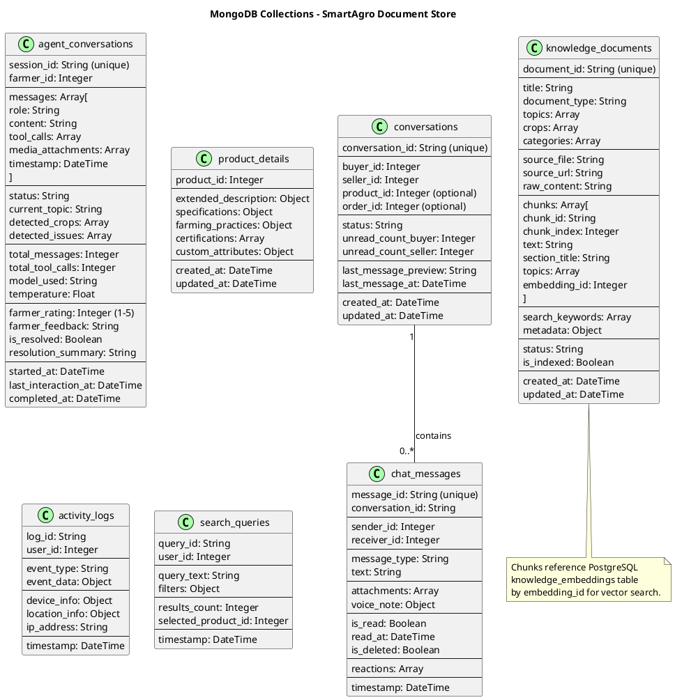

# SmartAgro Database Schema

## PostgreSQL Entity Relationship Diagram

```plantuml
@startuml SmartAgro_Complete_ERD
!define Table(name,desc) class name as "desc" << (T,#FFAAAA) >>
!define primary_key(x) <b><color:red>PK:</color> x</b>
!define foreign_key(x) <color:blue>FK:</color> <i>x</i>
!define unique(x) <u>x</u>

hide methods
hide stereotypes

title  Entity Relationship Diagram - SmartAgro PostgreSQL Schema

' ==================== USERS & AUTH ====================

Table(users, "users") {
    primary_key(id): SERIAL
    --
    unique(email): VARCHAR(255)
    unique(phone_number): VARCHAR(20)
    password_hash: VARCHAR(255)
    full_name: VARCHAR(255)
    user_type: ENUM
    profile_image_url: TEXT
    --
    email_verified: BOOLEAN
    phone_verified: BOOLEAN
    is_verified: BOOLEAN
    verification_method: VARCHAR(20)
    verification_document_url: TEXT
    --
    region: VARCHAR(50)
    district: VARCHAR(100)
    town_city: VARCHAR(100)
    gps_address: VARCHAR(50)
    detailed_address: TEXT
    latitude: DECIMAL(10,8)
    longitude: DECIMAL(11,8)
    --
    wallet_balance: DECIMAL(12,2)
    bank_name: VARCHAR(100)
    bank_code: VARCHAR(10)
    account_number: VARCHAR(20)
    account_name: VARCHAR(255)
    --
    paystack_recipient_code: VARCHAR(255)
    paystack_subaccount_code: VARCHAR(255)
    --
    account_status: ENUM
    is_active: BOOLEAN
    language_preference: VARCHAR(10)
    notification_enabled: BOOLEAN
    sms_notification_enabled: BOOLEAN
    --
    farm_name: VARCHAR(255)
    farm_size_acres: DECIMAL(10,2)
    years_farming: INTEGER
    --
    average_rating: DECIMAL(3,2)
    total_reviews: INTEGER
    total_sales: INTEGER
    total_purchases: INTEGER
    --
    created_at: TIMESTAMP
    updated_at: TIMESTAMP
    last_login_at: TIMESTAMP
    last_active_at: TIMESTAMP
}

Table(otp_verifications, "otp_verifications") {
    primary_key(id): SERIAL
    --
    foreign_key(user_id): INTEGER
    --
    otp_code: VARCHAR(6)
    otp_type: ENUM
    email: VARCHAR(255)
    phone_number: VARCHAR(20)
    --
    is_used: BOOLEAN
    is_expired: BOOLEAN
    expires_at: TIMESTAMP
    verified_at: TIMESTAMP
    attempts: INTEGER
    max_attempts: INTEGER
    --
    created_at: TIMESTAMP
}

' ==================== PRODUCTS ====================

Table(products, "products") {
    primary_key(id): SERIAL
    --
    foreign_key(seller_id): INTEGER
    --
    product_name: VARCHAR(255)
    category: ENUM
    description: TEXT
    --
    quantity_available: DECIMAL(10,2)
    unit_of_measure: ENUM
    price_per_unit: DECIMAL(10,2)
    minimum_order_quantity: DECIMAL(10,2)
    --
    harvest_date: DATE
    expected_shelf_life_days: INTEGER
    expiry_alert_days: INTEGER
    --
    farm_location: VARCHAR(255)
    region: VARCHAR(50)
    district: VARCHAR(100)
    gps_coordinates: VARCHAR(100)
    --
    primary_image_url: TEXT
    additional_images: TEXT[]
    --
    is_organic: BOOLEAN
    certification_details: TEXT
    --
    status: ENUM
    is_featured: BOOLEAN
    is_negotiable: BOOLEAN
    --
    view_count: INTEGER
    order_count: INTEGER
    total_sold: DECIMAL(10,2)
    --
    created_at: TIMESTAMP
    updated_at: TIMESTAMP
}

' ==================== ORDERS & TRANSACTIONS ====================

Table(orders, "orders") {
    primary_key(id): SERIAL
    --
    foreign_key(buyer_id): INTEGER
    foreign_key(seller_id): INTEGER
    foreign_key(product_id): INTEGER
    --
    quantity_ordered: DECIMAL(10,2)
    unit_price: DECIMAL(10,2)
    subtotal: DECIMAL(10,2)
    platform_fee: DECIMAL(10,2)
    delivery_fee: DECIMAL(10,2)
    total_amount: DECIMAL(10,2)
    --
    delivery_address: TEXT
    delivery_region: VARCHAR(50)
    delivery_district: VARCHAR(100)
    delivery_gps: VARCHAR(50)
    delivery_phone: VARCHAR(20)
    delivery_notes: TEXT
    --
    expected_delivery_date: DATE
    actual_delivery_date: DATE
    shipped_at: TIMESTAMP
    delivered_at: TIMESTAMP
    --
    tracking_number: VARCHAR(100)
    tracking_notes: TEXT
    buyer_notes: TEXT
    seller_notes: TEXT
    --
    status: ENUM
    payment_reference: VARCHAR(255)
    payment_method: VARCHAR(50)
    --
    cancelled_reason: TEXT
    foreign_key(cancelled_by_user_id): INTEGER
    cancelled_at: TIMESTAMP
    --
    created_at: TIMESTAMP
    updated_at: TIMESTAMP
    completed_at: TIMESTAMP
}

Table(escrow_transactions, "escrow_transactions") {
    primary_key(id): SERIAL
    --
    foreign_key(order_id): INTEGER
    foreign_key(buyer_id): INTEGER
    foreign_key(seller_id): INTEGER
    --
    amount: DECIMAL(12,2)
    currency: VARCHAR(3)
    platform_fee: DECIMAL(10,2)
    seller_payout: DECIMAL(12,2)
    --
    paystack_reference: VARCHAR(255)
    paystack_status: VARCHAR(50)
    paystack_transfer_code: VARCHAR(255)
    paystack_paid_at: TIMESTAMP
    --
    status: ENUM
    --
    auto_release_date: TIMESTAMP
    dispute_deadline: TIMESTAMP
    --
    released_at: TIMESTAMP
    foreign_key(released_to_user_id): INTEGER
    refunded_at: TIMESTAMP
    refund_amount: DECIMAL(12,2)
    partial_refund_amount: DECIMAL(12,2)
    --
    admin_notes: TEXT
    --
    created_at: TIMESTAMP
    updated_at: TIMESTAMP
}

Table(disputes, "disputes") {
    primary_key(id): SERIAL
    --
    foreign_key(escrow_id): INTEGER
    foreign_key(order_id): INTEGER
    foreign_key(raised_by_user_id): INTEGER
    --
    reason: TEXT
    evidence_description: TEXT
    evidence_image_urls: TEXT[]
    --
    seller_response: TEXT
    seller_evidence_urls: TEXT[]
    seller_response_at: TIMESTAMP
    --
    status: ENUM
    resolution: ENUM
    resolution_amount: DECIMAL(10,2)
    resolution_notes: TEXT
    --
    foreign_key(resolved_by_admin_id): INTEGER
    resolved_at: TIMESTAMP
    --
    auto_refund_date: TIMESTAMP
    priority: VARCHAR(20)
    --
    created_at: TIMESTAMP
    updated_at: TIMESTAMP
}

' ==================== NOTIFICATIONS & REVIEWS ====================

Table(notifications, "notifications") {
    primary_key(id): SERIAL
    --
    foreign_key(user_id): INTEGER
    --
    type: ENUM
    title: VARCHAR(255)
    message: TEXT
    data: JSONB
    --
    foreign_key(related_order_id): INTEGER
    foreign_key(related_user_id): INTEGER
    action_url: VARCHAR(500)
    --
    is_read: BOOLEAN
    read_at: TIMESTAMP
    --
    sms_sent: BOOLEAN
    sms_sent_at: TIMESTAMP
    --
    created_at: TIMESTAMP
}

Table(reviews, "reviews") {
    primary_key(id): SERIAL
    --
    foreign_key(order_id): INTEGER
    foreign_key(reviewer_id): INTEGER
    foreign_key(reviewed_user_id): INTEGER
    --
    rating: INTEGER
    review_text: TEXT
    --
    quality_rating: INTEGER
    communication_rating: INTEGER
    delivery_rating: INTEGER
    --
    response: TEXT
    response_at: TIMESTAMP
    --
    is_verified_purchase: BOOLEAN
    is_flagged: BOOLEAN
    flagged_reason: TEXT
    helpful_count: INTEGER
    --
    created_at: TIMESTAMP
    updated_at: TIMESTAMP
}

' ==================== AI KNOWLEDGE BASE ====================

Table(crop_knowledge, "crop_knowledge") {
    primary_key(id): SERIAL
    --
    crop_name: VARCHAR(100)
    category: VARCHAR(50)
    local_name_twi: VARCHAR(100)
    local_name_ga: VARCHAR(100)
    --
    content: TEXT
    content_type: VARCHAR(50)
    embedding: TEXT
    --
    source: VARCHAR(255)
    source_url: TEXT
    reliability_score: DECIMAL(3,2)
    --
    tags: VARCHAR[]
    applicable_regions: VARCHAR[]
    planting_season: VARCHAR(50)
    language: VARCHAR(10)
    --
    created_at: TIMESTAMP
    updated_at: TIMESTAMP
}

Table(knowledge_embeddings, "knowledge_embeddings") {
    primary_key(id): SERIAL
    --
    document_id: VARCHAR(100)
    unique(chunk_id): VARCHAR(100)
    --
    chunk_text: TEXT
    chunk_index: INTEGER
    embedding: TEXT (VECTOR 1536)
    --
    document_type: VARCHAR(50)
    topics: VARCHAR[]
    crops: VARCHAR[]
    section_title: VARCHAR(255)
    --
    search_text: TEXT
    --
    created_at: TIMESTAMP
}

note right of knowledge_embeddings
    Links to MongoDB knowledge_documents
    by document_id for full content.

    embedding column uses pgvector
    for semantic similarity search.
end note

' ==================== SYSTEM & ADMIN ====================

Table(system_configuration, "system_configuration") {
    primary_key(id): SERIAL
    --
    unique(key): VARCHAR(100)
    value: TEXT
    description: TEXT
    --
    updated_at: TIMESTAMP
    foreign_key(updated_by_admin_id): INTEGER
}

note right of system_configuration
    Stores configurable values:
    - AGENT_SYSTEM_PROMPT
    - PLATFORM_FEE_PERCENTAGE
    - WELCOME_MESSAGE
end note

Table(admin_actions, "admin_actions") {
    primary_key(id): SERIAL
    --
    foreign_key(admin_id): INTEGER
    --
    action_type: ENUM
    target_type: VARCHAR(50)
    target_id: INTEGER
    --
    details: JSONB
    reason: TEXT
    before_state: JSONB
    after_state: JSONB
    --
    timestamp: TIMESTAMP
}

' ==================== RELATIONSHIPS ====================

users "1" -- "0..*" otp_verifications: has
users "1" -- "0..*" products: sells
users "1" -- "0..*" orders: buys
users "1" -- "0..*" orders: fulfills
users "1" -- "0..*" notifications: receives
users "1" -- "0..*" reviews: gives
users "1" -- "0..*" reviews: receives
users "1" -- "0..*" disputes: raises
users "1" -- "0..*" disputes: resolves(admin)
users "1" -- "0..*" admin_actions: performs
users "1" -- "0..*" system_configuration: updates

products "1" -- "0..*" orders: ordered_in

orders "1" -- "0..1" escrow_transactions: secured_by
orders "1" -- "0..1" reviews: has_review
orders "1" -- "0..1" disputes: has_dispute

escrow_transactions "1" -- "0..*" disputes: disputed

@enduml
```

## MongoDB Collections

## Database Summary

### PostgreSQL Tables (12)
| Table | Purpose |
|-------|---------|
| `users` | User accounts (farmers, buyers, admins) |
| `otp_verifications` | OTP codes for phone/email verification |
| `products` | Product listings |
| `orders` | Order transactions |
| `escrow_transactions` | Payment escrow records |
| `disputes` | Order disputes |
| `notifications` | In-app notifications |
| `reviews` | User reviews/ratings |
| `crop_knowledge` | Legacy crop knowledge (being replaced) |
| `knowledge_embeddings` | Vector embeddings for hybrid search |
| `system_configuration` | Configurable system settings |
| `admin_actions` | Admin audit log |

### MongoDB Collections (7)
| Collection | Purpose |
|------------|---------|
| `conversations` | Chat conversation metadata |
| `chat_messages` | Individual chat messages |
| `agent_conversations` | AI agent chat sessions |
| `knowledge_documents` | Full knowledge base documents |
| `product_details` | Extended product attributes |
| `activity_logs` | User activity tracking |
| `search_queries` | Search analytics |
