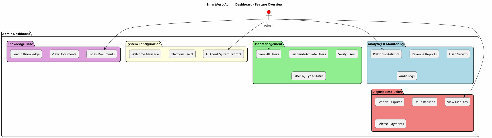
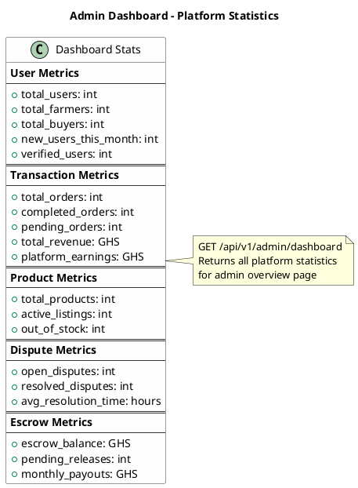
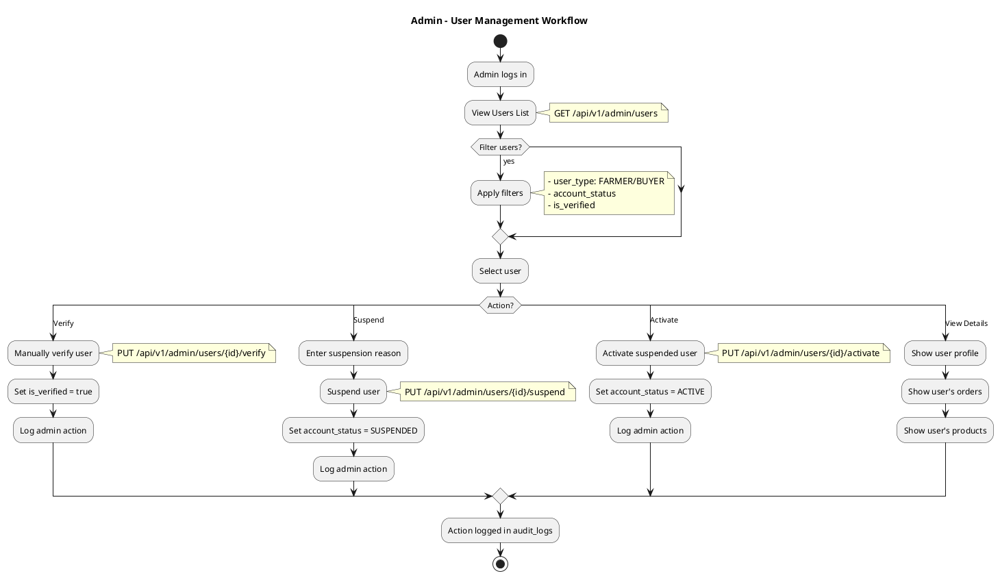
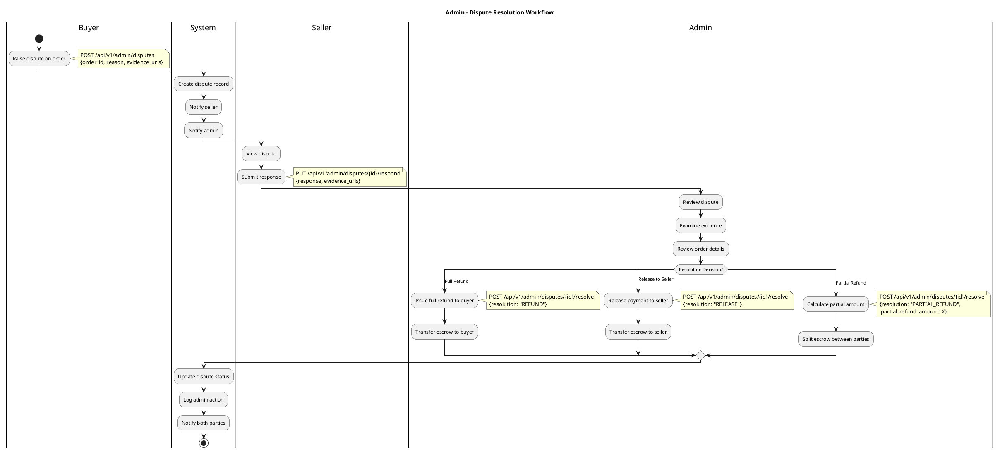
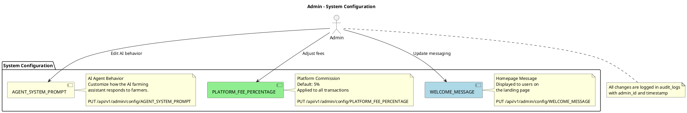
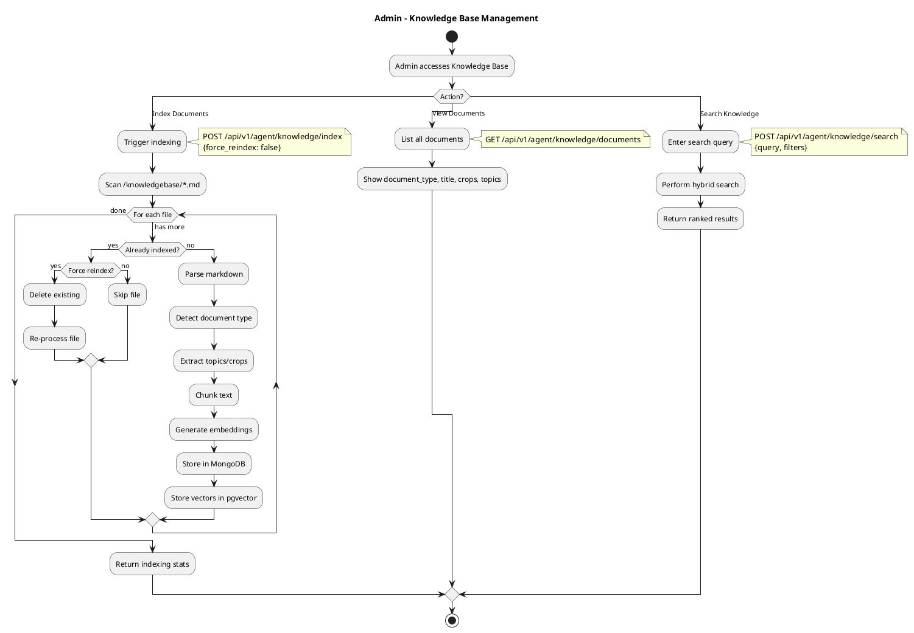
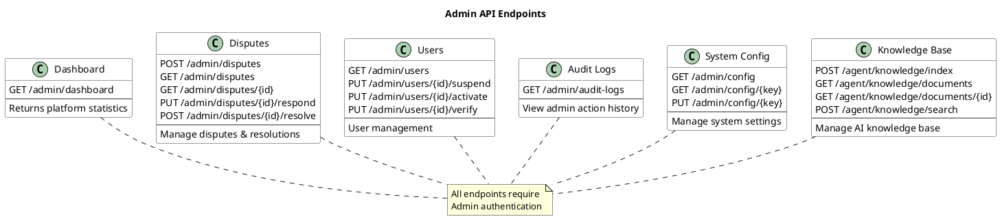

# Admin Dashboard Features

## High-Level Feature Overview

## Dashboard Statistics

## User Management Flow

## Dispute Resolution Flow

## System Configuration Management

## Knowledge Base Management

## Admin API Endpoints Summary

## Feature Access Matrix

| Feature | Endpoint | Description |
|---------|----------|-------------|
| **Dashboard** | `GET /admin/dashboard` | Platform statistics & metrics |
| **List Users** | `GET /admin/users` | View all users with filters |
| **Suspend User** | `PUT /admin/users/{id}/suspend` | Suspend a user account |
| **Activate User** | `PUT /admin/users/{id}/activate` | Reactivate suspended account |
| **Verify User** | `PUT /admin/users/{id}/verify` | Manually verify a user |
| **Raise Dispute** | `POST /admin/disputes` | Create new dispute |
| **List Disputes** | `GET /admin/disputes` | View all disputes |
| **Resolve Dispute** | `POST /admin/disputes/{id}/resolve` | Admin resolution |
| **Audit Logs** | `GET /admin/audit-logs` | View action history |
| **List Config** | `GET /admin/config` | View all settings |
| **Update Config** | `PUT /admin/config/{key}` | Change system setting |
| **Index KB** | `POST /agent/knowledge/index` | Index knowledge base |
| **List KB Docs** | `GET /agent/knowledge/documents` | View indexed documents |
