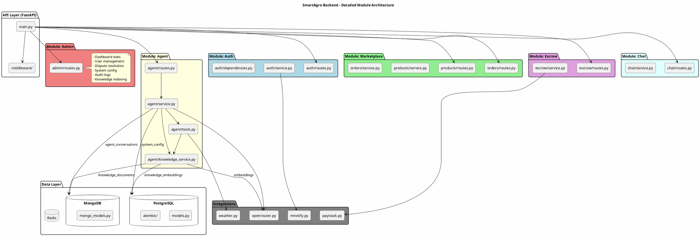
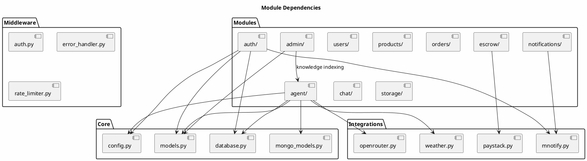

# Backend Internal Architecture

## Component Diagram - FastAPI Application

```plantuml
@startuml SmartAgro_Component_Diagram
!include https://raw.githubusercontent.com/plantuml-stdlib/C4-PlantUML/master/C4_Component.puml

title Component Diagram - FastAPI Backend

Container_Boundary(api, "FastAPI Application") {
    Component(auth, "Authentication", "JWT Module", "Login, signup, OTP, token management")
    Component(marketplace, "Marketplace", "Product/Order Module", "Product listings, order management")
    Component(escrow, "Escrow Service", "Payment Module", "Manages fund holding and release")
    Component(chat, "Chat Service", "Messaging Module", "Buyer-seller messaging")
    Component(agent, "AI Agent Service", "Farming Assistant", "LLM-powered advisor with tools")
    Component(knowledge, "Knowledge Service", "RAG Pipeline", "Document indexing & hybrid search")
    Component(notification, "Notification Service", "Alert Module", "In-app and SMS notifications")
    Component(admin, "Admin Service", "Management Module", "Disputes, users, config, audit")
    Component(storage, "Storage Service", "File Upload Module", "Images, audio, video uploads")
}

ContainerDb(postgres, "PostgreSQL", "Relational DB + pgvector")
ContainerDb(mongo, "MongoDB", "Document DB")
ContainerDb(redis, "Redis", "Cache & Sessions")
ContainerDb(spaces, "DO Spaces", "Object Storage")

System_Ext(paystack, "Paystack", "Payments")
System_Ext(mnotify, "mNotify", "SMS")
System_Ext(openrouter, "OpenRouter", "LLM & Embeddings")
System_Ext(openweather, "OpenWeatherMap", "Weather")

' Auth connections
Rel(auth, postgres, "Users, OTPs, sessions")
Rel(auth, redis, "JWT token blacklist")
Rel(auth, mnotify, "OTP SMS")

' Marketplace connections
Rel(marketplace, postgres, "Products, orders")
Rel(marketplace, mongo, "Product details")
Rel(marketplace, redis, "Cache listings")
Rel(marketplace, notification, "Order alerts")

' Escrow connections
Rel(escrow, postgres, "Escrow transactions")
Rel(escrow, paystack, "Payments, transfers")
Rel(escrow, notification, "Payment alerts")

' Chat connections
Rel(chat, mongo, "Messages, conversations")
Rel(chat, notification, "New message alerts")

' AI Agent connections
Rel(agent, mongo, "Agent conversations")
Rel(agent, postgres, "System config (prompt)")
Rel(agent, knowledge, "Search knowledge")
Rel(agent, openrouter, "LLM chat completion")
Rel(agent, openweather, "Weather data")
Rel(agent, marketplace, "Farmer products/orders")
Rel(agent, escrow, "Farmer earnings")

' Knowledge Service connections
Rel(knowledge, postgres, "Embeddings (pgvector)")
Rel(knowledge, mongo, "Full documents")
Rel(knowledge, openrouter, "Generate embeddings")

' Notification connections
Rel(notification, postgres, "Notifications")
Rel(notification, mnotify, "SMS")

' Admin connections
Rel(admin, postgres, "Users, disputes, config, audit")
Rel(admin, escrow, "Resolve disputes")
Rel(admin, knowledge, "Index knowledge base")

' Storage connections
Rel(storage, spaces, "Files")
Rel(marketplace, storage, "Product images")
Rel(chat, storage, "Voice notes")
Rel(agent, storage, "Multimodal uploads")

@enduml
```

## Detailed Module Architecture



## Data Flow - Agent Chat Request

```plantuml
@startuml Agent_Data_Flow
skinparam backgroundColor #FEFEFE

title Data Flow - AI Agent Chat Request

actor Farmer
participant "routes.py" as Routes
participant "service.py" as Service
participant "tools.py" as Tools
participant "knowledge_service.py" as Knowledge
database PostgreSQL as PG
database MongoDB as Mongo
cloud OpenRouter as LLM
cloud OpenWeather as Weather

Farmer -> Routes: POST /agent/chat/stream
Routes -> Service: chat_stream()

== Initialize ==
Service -> PG: get_system_prompt()
PG --> Service: AGENT_SYSTEM_PROMPT
Service -> Mongo: load conversation history
Mongo --> Service: previous messages

== LLM Call ==
Service -> LLM: chat.completions.create(stream=True)

== Tool Execution Loop ==
LLM --> Service: tool_call: search_knowledge
Service -> Tools: execute_tool("search_knowledge")
Tools -> Knowledge: hybrid_search()
Knowledge -> LLM: generate query embedding
LLM --> Knowledge: embedding vector
Knowledge -> PG: semantic search (pgvector)
PG --> Knowledge: top chunks by similarity
Knowledge -> PG: keyword search (full-text)
PG --> Knowledge: matching chunks
Knowledge --> Tools: combined results
Tools --> Service: knowledge results
Service -> LLM: submit tool result

== Response Generation ==
LLM --> Service: streaming tokens
Service --> Routes: SSE events
Routes --> Farmer: token by token

== Save ==
Service -> Mongo: save assistant response

@enduml
```

## Module Dependencies



## API Route Structure

| Prefix | Module | Description |
|--------|--------|-------------|
| `/auth` | auth | Authentication (login, signup, OTP) |
| `/api/v1/users` | users | User profile management |
| `/api/v1/products` | products | Product CRUD |
| `/api/v1/orders` | orders | Order management |
| `/api/v1/escrow` | escrow | Payment & escrow |
| `/api/v1/chat` | chat | Buyer-seller messaging |
| `/api/v1/agent` | agent | AI farming assistant |
| `/api/v1/notifications` | notifications | User notifications |
| `/api/v1/admin` | admin | Admin dashboard |
| `/api/v1/storage` | storage | File uploads |
| `/webhooks` | integrations | External webhooks |

## Key Files per Module

### Agent Module (`modules/agent/`)
| File | Purpose |
|------|---------|
| `routes.py` | API endpoints (chat, sessions, knowledge) |
| `service.py` | FarmingAgent class, streaming, conversation management |
| `tools.py` | Tool definitions and execution |
| `knowledge_service.py` | Document indexing, hybrid search, embeddings |

### Admin Module (`modules/admin/`)
| File | Purpose |
|------|---------|
| `routes.py` | Dashboard, users, disputes, config, audit logs |

### Escrow Module (`modules/escrow/`)
| File | Purpose |
|------|---------|
| `routes.py` | Payment initialization |
| `service.py` | Escrow lifecycle management |
