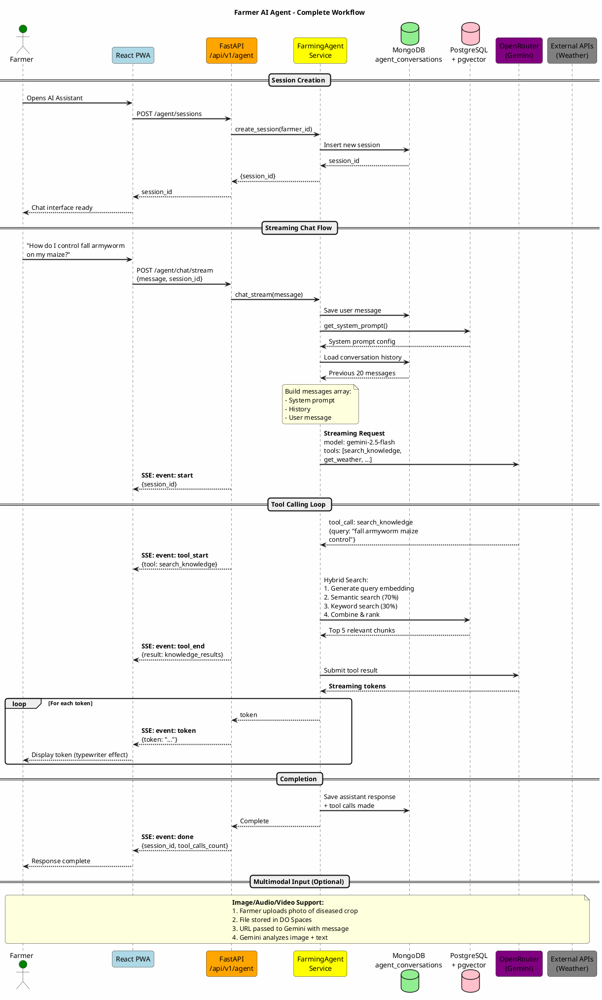
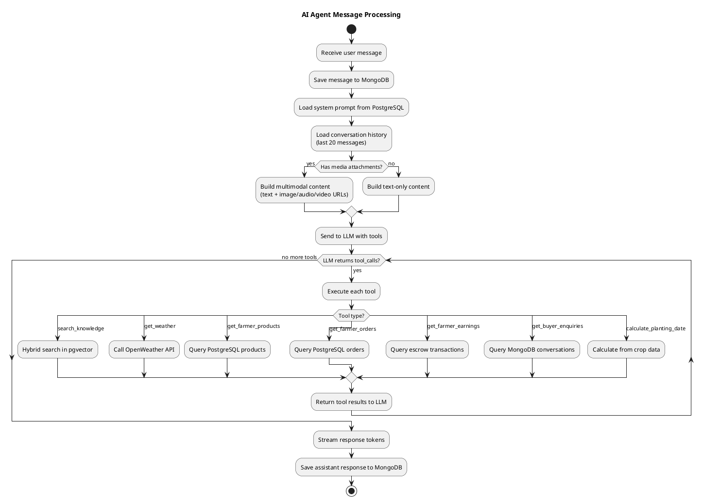
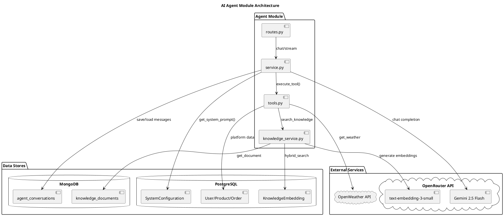

# Farmer AI Agent Workflow

## Sequence Diagram - Complete Agent Flow

## Activity Diagram - Agent Processing

## Component Diagram - Agent Architecture

## Available Agent Tools

| Tool | Description | Data Source |
|------|-------------|-------------|
| `search_knowledge` | Search agricultural knowledge base | PostgreSQL (pgvector) + MongoDB |
| `get_weather` | Weather forecast for Ghana locations | OpenWeather API |
| `get_farmer_products` | Farmer's product listings | PostgreSQL (products) |
| `get_farmer_orders` | Farmer's sales/orders | PostgreSQL (orders) |
| `get_farmer_earnings` | Earnings & payout info | PostgreSQL (escrow) |
| `get_buyer_enquiries` | Messages from buyers | MongoDB (conversations) |
| `calculate_planting_date` | Optimal planting date calculator | Internal crop data |

## SSE Event Types

| Event | Description | Data |
|-------|-------------|------|
| `start` | Stream initiated | `{session_id}` |
| `token` | Response token | `{token: "..."}` |
| `tool_start` | Tool execution starting | `{tool, arguments}` |
| `tool_end` | Tool execution complete | `{tool, result, execution_time_ms}` |
| `done` | Stream complete | `{session_id, tool_calls_count}` |
| `error` | Error occurred | `{error: "..."}` |
